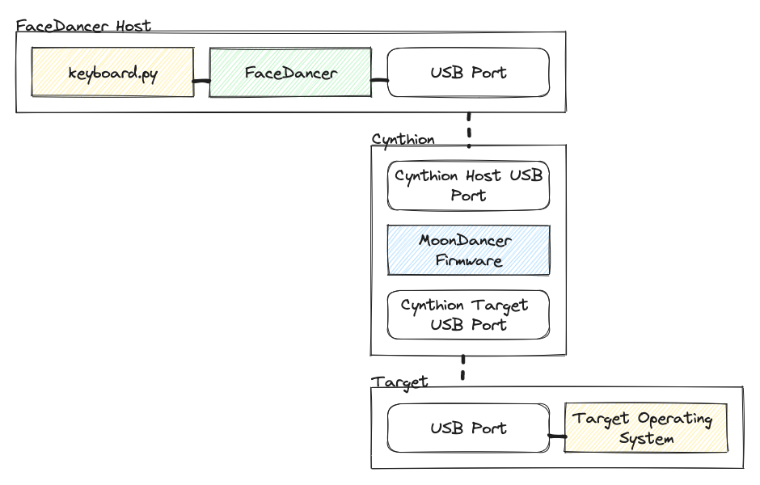

# MoonDancer: A FaceDancer backend for Cynthion

## Introduction

One of the core features we have not yet covered in an update is Cynthion's support for emulating USB devices in Python with [FaceDancer](https://github.com/greatscottgadgets/facedancer).

Much like GreatFET and others before it, FaceDancer can now also use Cynthion to remotely control USB ports.

But why would one want to do such a thing?

Well, the USB protocol is simply a series of signals over wire which are completely independent of the actual device being controlled.

The actual meaning of those signals are agreed on by the device and the software running on the connected host.

What this means is that if we had a way of directly programming a USB controller we gain direct control over the data being encoded in the USB streams.

This allows us to do all kind of fun things such as:

* Pretend to be any physical USB device such as a keyboard, a storage device or even a MIDI controller.
* Act as a programmable proxy between a device and its host with the ability to inspect or even modify the data stream.
* Perform fuzz testing on host-side USB device drivers by deliberately sending malformed data that can trigger faults in the device or host software.

For example, let's say we needed to automate the operation of a computer running some software that can only accept keyboard input:


With FaceDancer we can instead write a small program that will appear to the host as a standard USB keyboard:



The best part being that we can now control what the keyboard is typing using Python like:

```python
async def type_letters():
    logging.info("Beginning message typing demo...")

    # Type ls.
    await asyncio.sleep(5)
    await device.type_letters('l', 's', '\n')

    # Echo hi.
    await asyncio.sleep(2)
    await device.type_string("echo hi, user\n")

    # Finally, try to pop calc, just for fun.
    logging.info("Bonus: trying to pop calc.")
    await device.type_string('r', modifiers=KeyboardModifiers.MOD_LEFT_META)
    await asyncio.sleep(0.5)
    await device.type_string('calc\n')
```


## How we did it

Previous iterations of FaceDancer-compatible hardware such as the [GoodFET](https://goodfet.sourceforge.net/hardware/goodfet42/) and [GreatFET One](http://greatscottgadgets.com/greatfet/) featured a microcontroller with an integrated USB PHY and controller such as the [LPC4330](https://www.nxp.com/products/processors-and-microcontrollers/arm-microcontrollers/general-purpose-mcus/lpc4300-arm-cortex-m4-m0/dual-core-cortex-m4-m0-264-kb-sram-2-hs-usb-with-on-chip-phy-ethernet-can-aes-spifi-sgpio-sct:LPC4330FBD144).

What makes Cynthion unique is that it is built around a FPGA connected to three USB2.0 PHY chips under the control of the open source LUNA USB gateware.

While this provides us with unparelled access to USB signals and their behaviour it also represented a number of significant engineering challenges for our team.

The most significant challenge being, of course, how will FaceDancer control the USB controllers?

On previous FaceDancer devices the controllers have been under software control via a FaceDancer device implementation in firmware running on the device CPU.

However, being a FPGA based platform Cynthion does not have a CPU!

At first glance, our choices appear to be:

1. Develop a FaceDancer device implementation as gateware.
2. Integrate a microcontroller into the Cynthion hardware design.

In principle a FaceDancer device merely acts as a forwarder between the USB controllers and the controlling host so a gateware implementation could be as simple as exposing the registers controlling Luna's [EPTRI triple-fifo endpoint peripheral](https://github.com/greatscottgadgets/luna/blob/main/luna/gateware/usb/usb2/interfaces/eptri.py) via a set of USB Vendor Class commands.

On the other hand, integrating a microcontroller into Cynthion would increase the design complexity significantly and add substantially to the bill of materials cost.

All things being equal we may have ended up with a gateware implementation were it not for a very recent shift in the computing landscape.

I'm talking of course, about the emergence of an open standard instruction set architure in the form of RISC-V.

The corresponding emergence of high quality, libre-licensed RISC-V implementation that fit onto even small FPGA's such as Cynthion's Lattice Semiconductor LFE5U-12F ECP5 offered an intriguing third possibility.

While a FaceDancer device implementation in gateware would be a very cool hack indeed we thought it would be even cooler to take an approach that would also let anyone use Cynthion as a tool for exploring USB in embedded environments as well as serving as a learning environment for anyone getting started with RISC-V, SoC (System-on-Chip) design and Embedded Rust.

This ended up entailing a number of distinct components:

* Integrating a libre-licensed RISC-V CPU and peripherals into a custom SoC design
* Embedded Rust support for our custom SoC design's peripherals
* A lightweight, low-level USB stack appropriate for LUNA's USB device controller
* SoC Firmware: MoonDancer
* FaceDancer backend for SoC Firmware


### MoonDancer SoC

At the heart of MoonDancer lies a simple RISC-V SoC design described in the [Amaranth](https://github.com/amaranth-lang/amaranth) Hardware Description Language (HDL):

* SpinalHDL [VexRiscV](https://github.com/SpinalHDL/VexRiscv) CPU
* Full RV32IMAC instruction set support
* 60 MHz clock speed
* 64 kilobytes of SRAM
* 4096 kilobytes L1 instruction cache
* 4096 kilobytes L1 data cache
* 2x GPIO peripherals
* 6x LED peripherals
* 1x UART peripheral
* 1x Timer peripheral
* 3x Luna USB "eptri" peripherals

While the feature set may be modest in comparison to most commercial micro-controllers, the full gateware source of every single component integrated within the design is libre-licensed with all [four freedoms](https://www.gnu.org/philosophy/free-sw.en.html#four-freedoms) intact.


None of this would have been possible even a few years ago and it is thanks to the efforts of a wide community that we were able to do it within the time and resources available to us:

* [Spinal HDL VecRiscv](https://github.com/SpinalHDL/VexRiscv)
* [amaranth-soc](https://github.com/amaranth-lang/amaranth-soc)
* [LambdaSoC](https://github.com/lambdaconcept/lambdasoc)
* [Luna](https://github.com/greatscottgadgets/luna)
* [LunaSoC](https://github.com/greatscottgadgets/luna-soc)

### MoonDancer Firmware

After bringing up our "hardware" platform for the MoonDancer firmware we faced a whole new set of obstacles. In commercial SoC development there is usually a whole second team tasked with creating the tooling, device drivers and development libraries for a new design.

This is where we got our first taste of why an open standard ISA is such a powerful idea.

While we would still have to develop our own device drivers and libraries for our design we did not need to create yet another fork of GCC to implement our own custom toolchain with compiler, debugger, linker and sundry utilities.

Thanks to the efforts of many contributors, both commercial and community, the [GNU toolchain](https://www.linux.org/threads/gnu-toolchain-explained.10570/) has been shipping RiscV support for some time now and Rust (via [LLVM](https://llvm.org/)) is able to compile binaries for many RiscV variants out the box.


#### lunasoc-pac

One of the fundamental building blocks in any Embedded Rust project is a Peripheral Access Crate (PAC) which provides safe register-level access to the processor's peripherals.

While there are already existing PAC's and even HAL's for RISC-V chips from companies such as Espressif and AllWinner there existed no equivalent for working with a custom-defined SoC implemented as gateware.

Fortunately, what most Rust PAC's have in common is that their code are largely generated from a [SVD](https://www.keil.com/pack/doc/CMSIS/SVD/html/svd_Format_pg.html) description of the processor and its peripheral registers using a tool called [`svd2rust`](https://docs.rs/svd2rust/latest/svd2rust/index.html).

One of our first jobs was therefore to extend the LunaSoC library with the ability to export SVD files generated directly from the SoC design.

Using `svd2rust` we were now able to easily generate a PAC for any LunaSoC design.

#### lunasoc-hal

While it is entirely possible to develop an entire firmware using just a PAC crate it would be nice to offer a friendler programming interface and the possibility of code re-use across different processors.

Normally a chip will come with some form of vendor-provided HAL that provides higher-level abstractions for communicating with the peripherals and some compatibility with other products in the vendor's product line.

There are also some larger frameworks that attempt to provide a similiar HAL common across many vendors.

The Embedded Rust community took a slightly different approach to this problem with the [embedded-hal](https://github.com/rust-embedded/embedded-hal) project.

The `embedded-hal` project provides a set of centrally defined traits to build an ecosystem of platform agnostic drivers.

By adopting `embedded-hal` for our LunaSoC designs we've made it possible for other LunaSoC users to easily target their own custom designs even if the underlying peripheral implementations differ. It also means that the `moondancer` firmware can be more easily ported to any other platform with an `embedded-hal` implementation.

At the time of writing we have implemented `embedded-hal` compliant drivers for all SoC peripherals including the `gpio`, `timer` and `serial` peripherals.

#### SmolUSB

A special case is the implementation for the `usb` peripherals as there is not yet an official `embedded-hal` specification for USB.

The closest we currently have is the [`usb-device`](https://github.com/rust-embedded-community/usb-device/) project providing an experimental USB stack for embedded devices.

Given the unique requirements represented by FaceDancer we made the call to develop our own driver infrastructure in the form of a new crate: `smolusb`

SmolUSB is a lightweight device-side USB stack.

It provides:

* a set of traits for implementing HAL device drivers
* data structures for defining device descriptors
* data structures for defining class and vendor requests
* device enumeration support

It does not require Rust `alloc` support, uses a single statically allocated buffer for read operations and supports [zero-copy](https://github.com/google/zerocopy) write operations.

What makes SmolUSB a little different from other USB stacks is that it is a very thin abstraction over the device driver.

While it does provide an API surface for high-level operations such as device enumeration it also provides several "escape hatches" that provide raw access to the behaviour of the underlying peripheral.

A good example of this would be the way that device enumeration works with a FaceDancer emulated peripheral.

Rather than relying on the device firmware itself to respond to enumeration requests received on Cynthion's Target port these commands are instead forwarded to the FaceDancer host which will then construct the enumeration responses to be sent back via the target port.

The Aux port, on the other hand, acts as a traditional USB device and relies on SmolUSB to handle enumeration requests from the FaceDancer host.


#### MoonDancer her self.

Now that we had our "hardware" platform, a toolchain, device drivers and development libraries we were finally in a position to implement a FaceDancer backend for Cynthion!

MoonDancer is the heart of Cynthion's FaceDancer support and is responsible for mediating all communication between FaceDancer and the remotely controlled USB peripheral.

On the host side, the MoonDancer backend is responsible for translating calls from FaceDancer into libgreat commands which are then received on Cynthion's Aux USB port, deserialized by libgreat and forwarded to the MoonDancer firmware which is responsible for operating the Cynthion's Target USB port:


To mediate communication between the backend and the MoonDancer firmware we've used a Rust implementation of the same [`libgreat`](https://greatfet.readthedocs.io/en/latest/libgreat_verb_signatures.html) RPC protocol used by GreatFET and other Great Scott open-source projects.

The power of libgreat is it's ability to generate and expose simple explorable API's via Python that allows for flexible communications between computers and embedded devices, embedded drivers, and more without having to get into the murky details of driver development, transports or serialization protocols.

We hope this design decision will also allow others to more easily develop and integrate their own custom firmware for embedded USB applications with host software!

Finally, the MoonDancer firmware implements the MoonDancer API for directly controlling the USB Peripheral via operations to manage port connection, bus reset, setting the device address, manage endpoints and send/receive of data packets.

## Conclusion

I hope you enjoyed this overview of what we've been working on. If you have access to Cynthion hardware and would like to try out MoonDancer please feel free to check out the project page:

https://

Also, if you're interested in custom SoC development and Embedded Rust, please check out:

https://

Most of the non-USB functionality has been tested on other ECP5 devices so, with a little bit of work, you should be able to get something going with your favorite development board.
