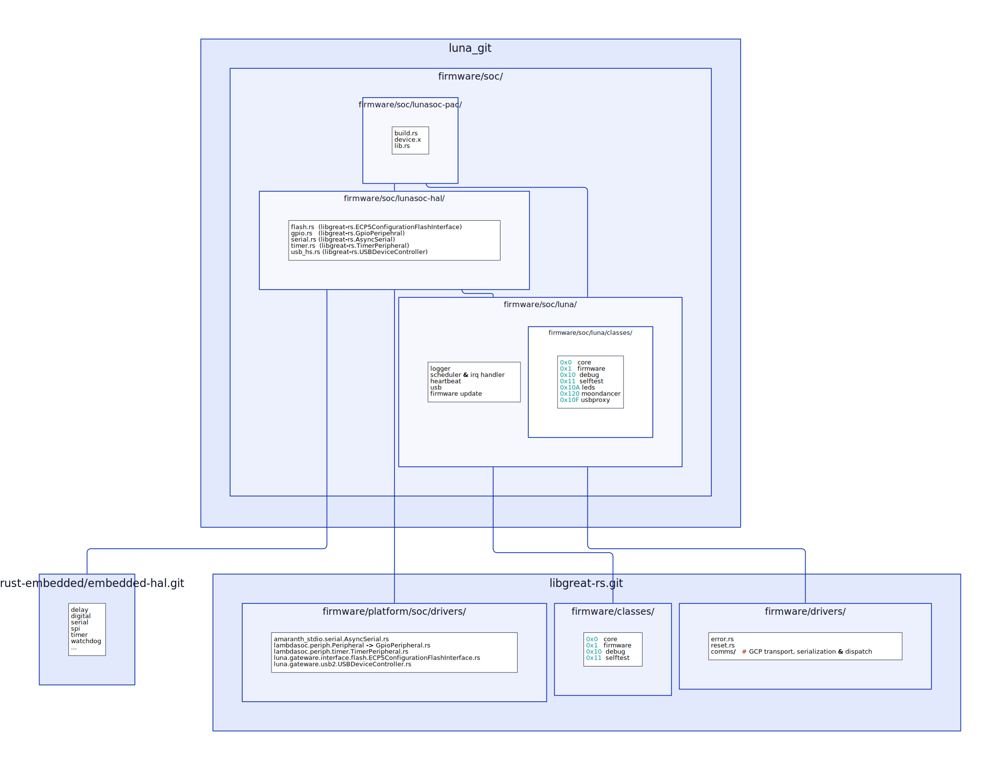

<!DOCTYPE html>
<html lang="en">
<head>
    <link rel="stylesheet" href="./rfp.css">
    <style>
        body { padding: 100px; }
        img { max-width: 1024; }
    </style>
    <meta charset="utf-8">
    <meta name="description" content="Luna Initial Design Specification">
    <meta name="viewport" content="width=device-width, initial-scale=1.0">
    <title>rfp.html</title>
</head>

<body>

# [FaceDancer: Implement Initial Design Specification / RFP #68](https://github.com/greatscottgadgets/luna/issues/68)

## Main Task

Create an initial design document describing a FaceDancer backend for LUNA.

This should:

* [x] Include plans for the core backend.
* [ ] Accommodate future FPGA acceleration, where possible.
* [ ] Accommodate fancy USBProxy enhancements.


---

## Terms

* Should = goal
* Shall = requirement
* Will = facts or declaration of purpose


---

## 1 Introduction

The Facedancer software is a host-side Python module for the control of simple hardware devices that act as "remote-controlled" USB controllers.

### 1.1 Data flow

Adding support to Facedancer for a new remote-controlled USB device ("the device") requires the implementation of a number of major components on both the controlling host ("the host") and the device being controlled.

This proposal will cover the requirements for the development of a Facedancer backend for the [Great Scott Gadgets Luna](https://greatscottgadgets.com/luna/).

Understanding the relationships between the major components of Facedancer can best be visualised in terms of the data flow between them:


The host side can be broken down into the following major components:

1. The *Luna Facedancer Backend*: `facedancer.git:/facedancer/backends/moondancer.py`
2. The *Luna host-side Python Library*: `luna.git:/host/`
3. The *Luna host-side CLI*: : `luna.git:/host/`
3. The *Host-side Command Serialisation and Transport Library*: `libgreat.git:/host/pygreat/`

The device side consists of the major components:

1. The *Device-side Transport Library*: `libgreat-rs.git:/firmware/drivers/`
2. The *Device-side Command Serialisation Library*: `libgreat-rs.git:/firmware/drivers/`
3. The *Luna Device API*: `luna.git:/luna/firmware/soc/classes/`
4. The *Luna SoC Firmware*: `luna.git:/luna/firmware/soc/`
5. The *Luna SoC Peripheral Drivers*: `libgreat-rs.git:/firmware/platform/soc/drivers/`
6. The *Luna SoC Gateware*: `luna.git:/luna/gateware/`
7. The *Luna Physical Hardware*: `luna.git:/hardware/`


---

## 2 Host Side Implementation

There is an existing host side implementation in Python which targets the [Great Scott Gadgets GreatFET](https://greatscottgadgets.com/greatfet/). We should be able to re-use much of the code with only minor modification and reorganisation of the existing codebase.

This section exists primarily to serve as a reference to how this code is organised.

<!--

 TODO split into individual diagrams for each section
 -->

The primary use-case for Facedancer is writing small Python scripts to automate the behaviour of Facedancer "Applets". Facedancer Applets are Python classes that encapsulate the behaviour of a given USB Device to be emulated.

For example:


Currently, there are two Applets available:

* [`FTDIDevice`](https://github.com/greatscottgadgets/Facedancer/blob/master/facedancer/devices/ftdi.py) - Emulated FTDI USB Serial device.
* [`USBKeyboardDevice`](https://github.com/greatscottgadgets/Facedancer/blob/master/facedancer/devices/keyboard.py) - Simple USB Keyboard device.

There are also a number of legacy Applets available that we will talk about more in [Section 6.1](#61-additional-facedancer-applets).

This user-facing scripting environment is abstracted away from any given Facedancer hardware allowing support to be extended for new devices.

The entry-point for adding new device support to Facedancer is via the implementation of a Luna Facedancer Backend.


### 2.1 Luna Facedancer Backend

A Facedancer host backend ("the facedancer backend) is responsible for servicing the API surface exposed to Facedancer Applets. ("the Facedancer Applet API")


As such, it is primarily responsible for enacting the following functionality on the device being controlled by Facedancer:

* Initialising the USB device, configuration, interface and endpoint descriptors of the emulated device.
* Reading data from the emulated device's endpoints.
* Writing data to the emulated device's endpoints.


### 2.2 Luna host-side Python Library

Great Scott Gadgets device commands are organised into a simple class/verb schema to define a transport-independent RPC protocol called the Great Communications Protocol ("GCP") for communication with a host-connected device.

Amongst other capabilities, this enables the automatic generation and population of a host-side Python API object that reflects the commands implemented in the firmware of the device.


For ease of debugging we should investigate various strategies by which we can improve on the instrumentation offered by the existing mechanism. Specifically there are two areas that would benefit from enhancement:

1. More readable stack traces.
1. Better interoperability with host-side code.

Strategies to investigate include:

* Appending metadata to API objects that can be used to generate better stack traces.
* Building host-side API's on stubs generated from a textual representation of the API rather than at runtime.
* The use and/or abuse of a tool such as [PyO3](https://github.com/PyO3/pyo3).
* Handrolled API implementation.

### 2.3 Command Serialisation and Transport Library

Luna uses USB as the transport for GCP messages.

The host-side implementation can be found in the [`pygreat`](https://github.com/greatscottgadgets/libgreat/tree/master/host/pygreat) library.


### 2.4 Main Tasks:

* [ ] Derive a new Luna Facedancer Backend from [facedancer.git:/facedancer/backends/greatdancer.py](https://github.com/greatscottgadgets/Facedancer/blob/master/facedancer/backends/greatdancer.py)
* [ ] Derive a new Luna host-side Python Library from [greatfet.git:/ host/greatfet/](https://github.com/greatscottgadgets/greatfet/tree/master/host/greatfet/)
* [ ] Investigate strategies for improving the existing host-side Python Libary implementation.
* [ ] Integrate the Command Serialisation and Transport Library from: [libgreat.git:/host/pygreat/comms_backends/usb.py](https://github.com/greatscottgadgets/libgreat/blob/master/host/pygreat/comms_backends/usb.py)


---

## 3 Device Side Firmware Implementation

The primary function of the Device Firmware is to implement the functionality invoked by GCP messages from Facedancer to the device.

Additional functionality includes logging, error handling, reset control, device heartbeat and SoC firmware updates.



The device firmware shall be implemented in Rust following established community guidelines for Embedded Rust development.


### 3.1 Luna SoC Firmware

The following functionality should be supported:

* Error handler
* Logger
* Reset control
* Task scheduler and interrupt handler
* Device heartbeat
* SoC firmware update

The Firmware shall have memory access to:

* SoC SRAM
* Optional: Flash
* Optional: HyperRAM


#### Reference Implementation

[greatfet.git:/firmware/greatfet_usb/](https://github.com/greatscottgadgets/greatfet/tree/master/firmware/greatfet_usb/)


### 3.2 Luna SoC Peripheral Drivers

Drivers should be implemented for the following SoC peripherals:

* `luna.gateware.soc.GpioPeripheral`
* `lambdasoc.periph.timer.TimerPeripheral`
* `amaranth_stdio.serial.AsyncSerial`
* `luna.gateware.usb2.USBDeviceController`
* `luna.gateware.interface.flash.ECP5ConfigurationFlashInterface`

Peripheral drivers will be organised across three crates:

* `lunasoc-pac`  - A peripheral register access API generated by `svd2rust`
* `amaranth-hal` - Concrete implementations of the device-independent `embedded-hal` traits for the peripherals.
* `lunasoc-hal`  - Re-exports of `libgreat-hal` and any peripherals that don't belong in amaranth-soc.

> Note: The embedded-hal drivers can live in `lunasoc-hal` during development but with the understanding that this code can potentially run on any SoC built using the `amaranth-soc` and `lambdasoc` libraries. As such, it would be beneficial to both GSG and the Amaranth community if it could find a forever home upstream.

#### Reference Implementation

[libgreat.git:/firmware/platform/lpc43xx/](https://github.com/greatscottgadgets/libgreat/tree/master/firmware/platform/lpc43xx)


### 3.3 Command Serialisation and Transport Library

The USB serialisation and Transport library is responsible for marshalling "Great Communication Protocol" commands from the host to the device.

Command execution takes the form of a host request containing the command class, verb and parameters followed by a device response containing one or more return parameters.

The library implementation shall follow the format and conventions established by the ["GreatFET Communications Protocol"](https://greatfet.readthedocs.io/en/latest/greatfet_classes.html).

We can break library implementation down into three main components:

#### 3.3.1. USB Transport

The USB transport is responsible for reading host requests and sending device responses using the  USBDeviceController peripheral driver.

#### 3.3.2. Command Serialisation

Command Serialisation is responsible for:

* Deserialising commands read from the USB transport to a Rust representation.
* Serialising command responses in Rust representation to USB transport responses.

#### 3.3.3. Command Dispatch

Command dispatch is responsible for:

* Dispatching GCP commands in Rust representation to their corresponding Rust implementations.
* Scheduling the command response for serialisation and transport.

#### Reference Implementation

[libgreat.git:/firmware/drivers/comms/](https://github.com/greatscottgadgets/libgreat/tree/master/firmware/drivers/comms/)


### 3.4 Luna Device API

#### The following GCP classes shall be implemented for the Luna device API:

* `0x0 core`
    - core device identification functionality
* `0x1 firmware`
    - verbs for working with/updating device firmware
* `0x10 debug`
    - debug utilities
* `0x11 selftest`
    - utilities for self-testing libgreat-based boards
* <del>0x105 usbhost</del> *no support planned at present*
    - remote control over Luna's USB ports in host mode, for e.g. FaceDancer
* `0x10A leds`
    - control over a given board’s LEDs
* `0x120 moondancer` (new class, implementing the verbs from `0x104 greatdancer`)
    - remote control over Luna's USB ports in device mode, for e.g. FaceDancer
* `0x10F usbproxy` *(is this currently supported ? see [Open Questions](#10-open-questions))*
    - Firmware functionality supporting USBProxy

#### Additional classes of interest are:

* `0x101 spi_flash`
    - verbs for programming SPI flashes
* `0x103 gpio`
    - control the GreatFET’s idle/”heartbeat” LED
* `0x107 glitchkit_usb`
    - control over functionality intended to help with timing USB fault injection
* `0x113 usb_analysis`
    - functionality for USB analysis e.g. with Rhododendron

#### The following GCP verbs shall be implemented for each class:

#### `0x0 core` - [`libgreat.git:/firmware/classes/core.c`](https://github.com/greatscottgadgets/libgreat/blob/master/firmware/classes/core.c)

Core device identification functionality:

* `0x0, core_verb_read_board_id() -> board_id: u32`
* `0x1, core_verb_read_version_string() -> [u8]`
* `0x2, core_verb_read_part_id() -> [u8; 8]`
* `0x3, core_verb_read_serial_number() -> [u8; 16]`
* `0x20, core_verb_request_reset()` (deprecated from core)

Internal introspection commands:

* `0x4, verb_get_available_classes`
* `0x5, verb_get_verb_name`
* `0x6, verb_get_verb_descriptor`
* `0x7, verb_get_available_verbs`
* `0x8, verb_get_class_name`
* `0x9, verb_get_class_docs`

#### `0x1 firmware` - [`libgreat.git:/firmware/classes/firmware.c`](https://github.com/greatscottgadgets/libgreat/blob/master/firmware/classes/firmware.c)

Verbs for working with/updating device firmware:

* `0x0, firmware_verb_initialize() -> (page_size: u32, total_size: u32)`
* `0x1, firmware_verb_full_erase()`
* `0x2, firmware_verb_erase_page(address: u32)`
* `0x3, firmware_verb_write_page(address: u32, data: Page)`
* `0x4, firmware_verb_read_page(address: u32) -> data: Page`

#### `0x10 debug` - [`greatfet.git:/firmware/greatfet_usb/classes/debug.c`](https://github.com/greatscottgadgets/greatfet/tree/master/firmware/greatfet_usb/classes/debug.c)

Debug utilities:

* Deprecated: `verb_read_dmesg()`
  - Replace with a dedicated USB endpoint for firmware logging output.
* `verb_clear_dmesg()`
* `verb_peek(address: u32) -> u32`
* `verb_poke(address: u32, value: u32)`

#### `0x11 selftest` - [`greatfet.git:/firmware/greatfet_usb/classes/selftest.c`](https://github.com/greatscottgadgets/greatfet/tree/master/firmware/greatfet_usb/classes/selftest.c)

Utilities for self-testing libgreat-based boards:

* Optional: `selftest_verb_measure_clock_frequencies(clock_numbers: [u32]) -> [clock_frequencies_mhz: u32]`
* Optional: `selftest_verb_measure_raw_clock_frequencies(clock_numbers: [u32]) ->  [clock_frequencies_mhz: u32] `

#### <del>0x105 usbhost</del>

Remote control over Luna's USB ports in host mode, for e.g. FaceDancer

*no support planned at present*


#### `0x10A leds` - [`greatfet.git:/firmware/greatfet_usb/classes/leds.c`](https://github.com/greatscottgadgets/greatfet/tree/master/firmware/greatfet_usb/classes/leds.c)

Control over a given board’s LEDs:

* `leds_verb_toggle(led_num)`
* `leds_verb_on(led_num)`
* `leds_verb_off(led_num)`

#### `0x120 moondancer` - [`greatfet.git:/firmware/greatfet_usb/classes/greatdancer.c`](https://github.com/greatscottgadgets/greatfet/tree/master/firmware/greatfet_usb/classes/greatdancer.c)

Remote control over Luna's USB ports in device mode, for e.g. FaceDancer

Connection / disconnection:

* `greatdancer_verb_connect(ep0_max_packet_size: u16, quirk_flags: u16`
* `greatdancer_verb_disconnect()`
* `greatdancer_verb_bus_reset()`

Enumeration / setup:

* `greatdancer_verb_set_address(address: u16, deferred: u8)`
* `greatdancer_verb_set_up_endpoints(endpoint_descriptors: [(address: u8, max_packet_size: u16, type: u8)])`

Status & control:

* `greatdancer_verb_get_status(register_type: u8) -> register_value: [u8; 4]`
* `greatdancer_verb_read_setup(endpoint_number: u8) -> raw_setup_packet: [u8; 8]`
* `greatdancer_verb_stall_endpoint(endpoint_address: u8)`

Data transfers:

* `greatdancer_verb_send_on_endpoint(endpoint_number: u8, data_to_send: [u8])`
* `greatdancer_verb_clean_up_transfer(endpoint_address: u8)`
* `greatdancer_verb_start_nonblocking_read(endpoint_number: u8)`
* `greatdancer_verb_finish_nonblocking_read(endpoint_number: u8) -> read_data: [u8; length]`
* `greatdancer_verb_get_nonblocking_data_length(endpoint_number: u8) -> length: u32`

#### `0x10F usbproxy` - [``]()

Firmware functionality supporting USBProxy.

TODO Investigate existing USBProxy implementation for GreatFET/Facedancer.

<!--
* ``
* ``
* ``
* ``
 -->


### 3.7 Main Tasks

#### Initial Bring-up

* [ ] Implement `hello-blinky` for LunaSoC.
* [ ] Implement `hello-uart` for LunaSoC.

#### Luna SoC Firmware

* [ ] Implement clock and reset control for the SoC.
* [ ] Configure memory access for:
    - SoC SRAM
    - Optional: SoC SPI Flash peripheral
    - Optional: SoC HyperRAMInterface Peripheral
* [ ] Implement a `no_std` error handling strategy that does not rely on the `alloc` feature.
* [ ] Implement a device logging strategy:
    - logs shall be recoverable following system panic.
    - logs shall be accessible at runtime via `0x10 debug`.
* [ ] Implement a task scheduling and interrupt handling strategy.
* [ ] Implement a device heartbeat mechanism.
* [ ] Implement a SoC firmware loading strategy.
* [ ] Implement a SoC firmware update mechanism.

#### Luna SoC Peripheral Drivers

* [ ] Implement an `embedded-hal` driver for `luna.gateware.soc.GpioPeripheral`
* [ ] Implement an `embedded-hal` driver for `lambdasoc.periph.timer.TimerPeripheral`
* [ ] Implement an `embedded-hal` driver for `amaranth_stdio.serial.AsyncSerial`
* [ ] Implement an `embedded-hal` driver for `luna.gateware.usb2.USBDeviceController`
* [ ] Optional: Implement an `embedded-hal` driver for `luna.gateware.interface.flash.ECP5ConfigurationFlashInterface`

#### Command Serialisation and Transport Library

* [ ] Implement a GCP transport for the USBDeviceController peripheral driver.
* [ ] Implement support for the "Great Communication Protocol" serialisation format.
    - Option: [`serde`](https://serde.rs/data-format.html)
    - Option: [`yoke`](https://hachyderm.io/@ekuber/109513137375293238)
* [ ] Extend GCP to add support for multiple concurrent USB streams.
* [ ] Implement GCP support for multiple concurrent USB streams.
* [ ] Implement a dispatch mechanism for GCP commands and responses.

#### Luna Device API

* [ ] Implement the device api for: `0x0 core`
* [ ] Implement the device api for: `0x1 firmware`
* [ ] Implement the device api for: `0x10 debug`
* [ ] Implement firmware log output via a dedicated USB endpoint.
  - Message metadata should include a monotonic counter in order to detect dropped messages.
* [ ] Optional: Implement the device api for: `0x11 selftest`
* [ ] Implement the device api for: `0x10A leds`
* [ ] Implement the device api for: `0x120 moondancer`
* [ ] Investigate existing USBProxy implementation for GreatFET/Facedancer.
* [ ] Implement the device api for: `0x10F usbproxy`


---

## 4 Device Side Gateware Implementation


The execution target for the Luna firmware is a Minerva RISC-V CPU implemented as gateware on an ECP5 and shall be configured with a number of peripherals for control of the Luna hardware's USB ports, Pmod ports, SPI Flash and HyperRAM.

Additional SoC peripherals shall include a system Timer, UART and JTAG port.

SoC peripheral access interfaces will be generated directly from the SoC definition and shall include targets for:

* C
* Rust

Rust target support will be implemented by converting the SoC definition to a [CMSIS-SVD](https://www.keil.com/pack/doc/CMSIS/SVD/html/svd_Format_pg.html) file that can be used to generate a Rust Peripheral Access Crate using the [`svd2rust`](https://github.com/rust-embedded/svd2rust/) tool.

Gateware shall be implemented in [Amaranth](https://github.com/amaranth-lang/amaranth) with the use of external libraries such as `Amaranth-SoC` and `LambdaSoC` where possible.

####  Reference Implementation

[luna.git:/gateware/soc/simplesoc.py](https://github.com/greatscottgadgets/luna/blob/main/luna/gateware/soc/simplesoc.py)


### 4.2 Main Tasks

#### Initial Bring-Up

* [ ] Update the `simplesoc.py` placeholder to the latest versions of the `amaranth-soc` and `lambdasoc` libraries.
* [ ] Implement SVD export for SoC designs
    - Bear in mind that this would benefit from finding a cosy home upstream.

#### Implement additional Peripherals

* [ ] GpioPeripheral
* [ ] Optional: SPIFlashPeripheral

#### Wire up additional Peripherals

* [ ] GpioPeripheral
* [ ] Optional: SPIFlashPeripheral / ECP5ConfigurationFlashInterface
* [ ] USBDeviceController
* [ ] HyperRAMInterface


---

## 5 Luna Host-side CLI

Luna should have a host-side command line interface which enables Luna owners to interact with the device hardware.

The following conventions should be respected:

* Commands shall be implemented as a single keyword containing no preceding or interceding dash or underscore tokens to distinguish them from flags.
* Flags shall be distinguished by a single dash (abbreviated flag name) and a double dash (expanded flag name).
* Abbreviated flag names shall use the first letter of their expanded variant. Where this leads to conflicts alternative wording should be explored for the expanded names.
* Abbreviated flag names shall be lower-case in order to reduce cognitive overhead.

### 5.1 Description

#### Utility Commands shall include:

* `info`: Displays information about connected Luna devices.
* `factory`: Restores the device to it's factory configuration state and applies any newly released firmware and gateware updates.
* `reset`: Performs a device reset.
* `shell`: Start up an interactive Python shell from which the Luna host-side Python Library can be called.

#### User Commands shall include:

* TBD - basically any top-level (i.e. non-facedancer) Luna functionality we're currently calling from standalone scripts.

#### Bitstream Commands shall include:

* `output`: Build and output a bitstream to the given file.
* `erase`: Clears the relevant FPGA's flash before performing other options.
* `upload`: Uploads the relevant design to the target hardware. Default if no options are provided.
* `flash`: Flashes the relevant design to the target hardware's configuration flash.

The following flags shall be supported:

* `--dry-run, -d`: When provided as the only option; builds the relevant bitstream without uploading or flashing it.
* `--keep-files, -k`: Keeps the local files in the default `build` folder.
* `--fpga, -f`: Overrides build configuration to build for a given FPGA. Useful if no FPGA is connected during build.
* `--console, -c`: Attempts to open a convenience 115200 8N1 UART console on the specified port immediately after uploading.

#### SoC Commands shall include:

* `upload`: Uploads the given SoC Firmware to the SoC.
* `flash`: Flashes the given SoC Firmware to the target hardware's configuration flash.
* `sdk`: Generates a developer SDK for programming the Luna SoC.

The following flags shall be supported:

* `--format=svd`:
* `--format=c-header`: A C header file for this design's SoC will be printed to the stdout. Other options ignored.
* `--format=ld-script`: A linker script for design's SoC memory regions be printed to the stdout. Other options ignored.
* `--format=rust-pac`: A Rust Peripheral Access Crate (PAC) for this design's SoC will be generated in the default `build/` directory.

#### Global flags shall include:

* `--help, -h`: Display Luna CLI help.
* `--build-dir, -b`: Override the default `build/` directory.
* `--` All flags following a naked double-dash will be passed to external tools invoked by the Luna CLI.
* TBD

#### Naming considerations

* Consider: `output` -> `bitstream`
* Resolve identical commands in separate contexts (e.g. `flash`)
    - Option: Use a class/verb structure for commands e.g. `luna bitstream flash` / `luna firmware flash`
    - Option: Use different command names e.g. `store` for bitstream, `flash` for firmware.

#### Reference Implementation:

* [`luna.git:/luna/__init__.py`](https://github.com/greatscottgadgets/luna/blob/main/luna/__init__.py)
* [`GreatFETArgumentParser`](https://github.com/greatscottgadgets/greatfet/blob/master/host/greatfet/utils.py#L137)

It's recommended that the design of `GreatFETArgumentParser` be adapted for general use, renamed to `GreatArgumentParser` and homed in `libgreat.git`.


### 5.2 Main Tasks

* [ ] ...


---

## 6 Additional Features

### 6.1 Additional Facedancer Applets

Facedancer device emulations are referred to as "Applets" (is this correct?) that can be found in the [facedancer.git:/facedancer/devices](https://github.com/greatscottgadgets/Facedancer/tree/master/facedancer/devices) directly.

There are currently Facedancer Applets for:

* [`FTDIDevice`](https://github.com/greatscottgadgets/Facedancer/blob/master/facedancer/devices/ftdi.py) - Emulated FTDI USB Serial device.
* [`USBKeyboardDevice`](https://github.com/greatscottgadgets/Facedancer/blob/master/facedancer/devices/keyboard.py) - Simple USB Keyboard device.

There are also a number of Facedancer Applets that live in the [facedancer.git:/legacy_applets/](https://github.com/greatscottgadgets/Facedancer/tree/master/legacy-applets) directory. If is due to API changes they should probably be refactored to the new API so that they be made available:

* `facedancer-edl`
* `facedancer-ftdi`
* `facedancer-host-enumeration`
* `facedancer-keyboard-interactive`
* `facedancer-keyboard`
* `facedancer-procontroller`
* `facedancer-serial`
* `facedancer-switchtas`
* `facedancer-umass`
* `facedancer-ums-doublefetch`

### 6.2 Support for Luna Pmod Ports

There exists an opportunity to make the GreatFET gpio-related commands available under Luna as well.

### 6.3 New Facedancer Applet Creation

Enabling new Facedancer Applet creation primarily requires that the Facedancer Applet API be documented.

### 6.4 USBProxy

TBD

### 6.5 USB Fuzzing

TBD

### 6.6 Main Tasks

* [ ] Bring Facedancer's legacy Applets up to date
* [ ] Support GreatFET gpio-related commands
* [ ] Document the Facedancer Applet API
* [ ] Specify USBProxy Support
* [ ] Implement USBProxy Support
* [ ] Specify USB Fuzzing Support
* [ ] Implement USB Fuzzing Support


---

## 7 Continuous Integration

### 7.1 Integration Tests

TBD

### 7.2 Host-side Tests

TBD

### 7.3 Device-side Tests

TBD

### 7.4 Main Tasks

* [ ] ...


---

## 8 Documentation

Primary documentation should be developed for:

* Getting started with Luna and Facedancer
* Facedancer Applet reference
* Luna host-side API reference
* Luna device-side API reference (docs.rs)

Additional documentation:

* Luna Tutorials
* Facedancer Applet API reference

### 8.1 References

* [GreatFET Tutorials](https://greatscottgadgets.github.io/greatfet-tutorials/)
* [GreatFET Project documentation](https://greatfet.readthedocs.io/en/latest/)
* [Facedancer README](https://github.com/greatscottgadgets/Facedancer/blob/master/README.md)

External:

* [WikiLeaks - Facedancer User Guide](https://wikileaks.org/ciav7p1/cms/page_20873567.html)
* [Travis Goodspeed - Emulating USB Devices with Python](https://travisgoodspeed.blogspot.com/2012/07/emulating-usb-devices-with-python.html)
* [Hackaday - Hands-on: GreatFET](https://hackaday.com/2019/07/02/hands-on-greatfet-is-an-embedded-tool-that-does-it-all/)
* [Colin O'Flunn - USB Attacks and More with GreatFET](https://circuitcellar.com/research-design-hub/usb-attacks-and-more-with-greatfet/)

### 8.2 Main Tasks

* [ ] ...


---

## 9 Code Organisation

The `luna.git` repository should utilise GSG repository layout conventions with the following top-level structure:

```
/ci-scripts  - Scripts used by CI
/docs        - Documentation
/firmware    - Device firmware
/hardware    - Device hardware (deprecated: see note below)
/gateware    - Device gateware
/host        - Host-side software
/tools       - Tools
```

> Note: The hardware release cycle operates on a different time-scale to software release cycles. Ideally device hardware should live in its own repository.

To reduce the maintenance burden across the larger Great Scott Gadgets codebase it's proposed to make some minor changes to the organisation of the greatfet.git and libgreat.git repositories.

### 9.1 Facedancer "Great Communication Protocol" class id:

Class ids currently live in:

https://github.com/greatscottgadgets/greatfet/blob/master/docs/source/greatfet_classes.rst

1. Move greatfet_classes.rst from greatfet.git into libgreat.git
2. Add class id for Luna

Also see: https://gsg.atlassian.net/wiki/spaces/MEETINGS/pages/2438824143/2022-12-06+Engineering+Work+Session

### 9.2 Common code from greatfet.git

There may be some common code in the greatfet.git python host code that needs to be made available to Luna. This may also need to move to the libreat.git repository.

This includes:

* https://github.com/greatscottgadgets/greatfet/blob/master/host/greatfet/commands/greatfet_usb_capture.py
* TODO

### 9.3 Conformance to GSG project directory layout conventions

For the `luna.git` repository the following changes should be made:

* `luna.git:/luna/gateware` -> `luna.git:/gateware`
* `luna.git:/luna/` -> `luna.git:/host/luna`

### 9.4 Git submodules aka "Kill It With Fire!"

A strategy of escalation for dependencies that exist as git submodules:

1. Prefer the packaged library form.
2. If a packaged library does not exist fork the project and submit an upstream PR.
3. Switch to the packaged library from our fork while waiting for the PR process to play out.
4. If upstream can/will not accept the PR consider moving to an alternate dependency more aligned with our use-case.
5. If another dependency does not exist there are two choices:
    - Maintain our fork indefinitely. Sometimes this is not a big deal and upstream positions often shift given time, congeniality and reflection.
    - Vendor the forked code into `libgreat.git` remembering to include licenses and a great-full acknowledgement.

This strategy is hard work that can cost a couple days work but we pay it forward because, in Glorious Socialist Federation of Neighbours, upstream project take care of you!

### 9.5 Facedancer "Applets"

Replace the term Facedancer "Applet" with the term Facedancer "Device Emulation".


---

## 10 Open Questions

* [x] are the Great Communication Protocol `0x105 usbhost` and `0x10F usbproxy` classes supported anywhere currently?
    - `0x105 usbhost`  - *no support planned at present*
    - `0x10F usbproxy` - investigate current GreatFET/Facedancer implementation.

* [x] how do we want to manage SoC firmware uploads to SPI flash
    - appended to the bitstream uploaded to SPI flash?
    - SoC bios takes over SPI flash after ECP5 boot and uses a dedicated region for separate upload?
    - Which of the many available tools should Luna CLI use if we support a separate flash operations?
    - @martinling: *"my feeling is that it would be preferable for this to be a separate mechanism implemented by the SoC bios after ECP5 boot, rather than the firmware being tacked onto the end of the bitstream image, because it would be nice to be able to iterate on the SoC firmware without reflashing the bitstream. I think dfu-util would be the most obvious choice of upload tool, but it's not the only option."*
    - Decision:
        * Separate from gateware.
        * Start with `dfu-util` to SRAM.
        * Add support for SPI Flash later.

* [x] do we want to support these additional usb-related classes for Luna:
    - `0x107 glitchkit_usb` - control over functionality intended to help with timing USB fault injection
    - `0x113 usb_analysis`  - functionality for USB analysis e.g. with Rhododendron
    - Decision: Optional

* [x] are there any constraints on the "Great Communications Protocol" implementation that will place limits on what we can do with Luna vs GreatFET?
    - @martinling: *"Constraints of GCP that might affect what we can do with LUNA: At a quick glance, it looks like one thing that's currently missing in the protocol is a way to set up multiple independent data streams to/from the host. There is a streaming mechanism in usb_streaming.c used by e.g. the logic analyzer function, but looking at the code for it, it seems to assume a single fixed endpoint in use. This makes sense for GreatFET, where we have a fixed number of hardware endpoints, but with LUNA we don't have that constraint, and there are bound to be use cases that would benefit from multiple concurrent streams."*

* [x] `libgreat-rs.git` -> `libgreat.git/firmware-rs/greatsoc-hal, greatsoc-pac` etc. or somesuch ?
    - the problem with having two repo's that both start with libgreat is that it may not be clear which one to look in?
    - on the other hand, nervous about putting the rust crate into libgreat because more complex CI and releases might ensue ?
    - Decided: There are more big reasons to stick to a single repo than small reasons not to.

* [x] Should we implement the main device firmware in a pure Rust `no_std` environment without the use of the `alloc` feature?
    - `alloc` comes with its own share of problems in the form of memory fragmentation and unpredictable latency.
    - are there any high-alloc areas of the code that can't be handled by e.g. the `heapless` crate.
    - @martinling: *"My feeling would be that we should aim to initially, but that we should be prepared to bring in an allocator if it proves to be unnecessarily difficult without one."*


---

## 11 Diagrams

### Dataflow Comparison of GreatFET and Luna


### Device-side Structural Decomposition


### Facedancer Call Graph


---

## 12 Appendix

### Links to Useful Documentation

* [GreatFET Documentation](https://greatfet.readthedocs.io/en/latest/)
    - [Verb Signatures](https://greatfet.readthedocs.io/en/latest/libgreat_verb_signatures.html)
    - [Classes](https://greatfet.readthedocs.io/en/latest/greatfet_classes.html)

External:

* [WikiLeaks - Facedancer User Guide](https://wikileaks.org/ciav7p1/cms/page_20873567.html)
* [Writing a Serde data format](https://serde.rs/data-format.html)
* [Beyond Logic - USB in a NutShell](https://www.beyondlogic.org/usbnutshell/)

### Repositories

* https://github.com/greatscottgadgets/luna
* https://github.com/greatscottgadgets/Facedancer
* https://github.com/greatscottgadgets/libgreat
* https://github.com/greatscottgadgets/greatfet

### Issues

* [FaceDancer: Implement Initial Design Specification / RFP #68](https://github.com/greatscottgadgets/luna/issues/68)
* [Facedancer SoC #151](https://github.com/greatscottgadgets/luna/issues/151)
* [LUNA support for Facedancer #59](https://github.com/greatscottgadgets/Facedancer/issues/59)


</body>
</html>
