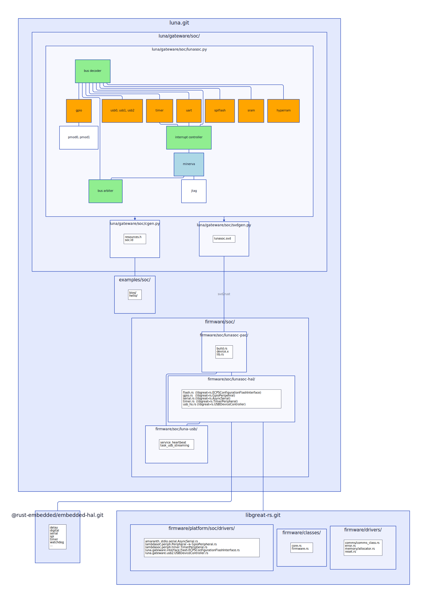

# [FaceDancer: Implement Initial Design Specification / RFP #68](https://github.com/greatscottgadgets/luna/issues/68)

Create an initial design document describing a FaceDancer backend for LUNA.

This should:

* [ ] Include plans for the core backend.
* [ ] Accommodate future FPGA acceleration, where possible.
* [ ] Accommodate fancy USBProxy enhancements.

---

## 1 Introduction

The Facedancer software is a host-side Python module for the control of simple hardware devices that act as "remote-controlled" USB controllers.

### 1.1 Data flow

Adding support to Facedancer for a new remote-controlled USB device ("the device") requires the implementation of a number of major components on both the controlling host ("the host") and the device being controlled.

Understanding the relationship of these components can best be visualized in terms of the data flow between them:

TODO walk through diagram

---

## 2 Implementation: Host Library

For the purposes of Luna we can largely re-use the existing GreatFET python code.

This section exists primarily to serve as a reference to how this code is organized.

TODO walk through diagram

### 2.1 Facedancer Backend

Example: [facedancer.git backends/greatdancer.py](https://github.com/greatscottgadgets/Facedancer/blob/master/facedancer/backends/greatdancer.py)

A Facedancer host backend ("the facedancer backend) is responsible for servicing the API surface exposed to Facedancer applets. ("the Facedancer applet API")

As such, it is primarily responsible for enacting the following functionality on the device being controlled by Facedancer:

* Initialize the USB device, configuration, interface and endpoint descriptors of the device.
* Read data from endpoints.
* Write data to endpoints.

Main task: Re-use the GreatFET `greatdancer` backend.

### 2.2 Device Commands

Example: [greatfet.git host/greatfet/](https://github.com/greatscottgadgets/greatfet/tree/master/host/greatfet/)

Great Scott Gadgets device commands are organized into a simple class/verb scheme to define a transport-independent format ("great communications protocol") for communication with a host-connected device.

The main classes supported by the Luna hardware are:

* `0x105 usbhost`
  - remote control over Luna’s USB ports in host mode, for e.g. FaceDancer
* `0x120 moondancer` (new class)
  - remote control over Luna’s USB ports in device mode, for e.g. FaceDancer

Additional classes of interest are:

* `0x107 glitchkit_usb`
  - control over functionality intended to help with timing USB fault injection
* `0x10F usbproxy`
  - Firmware functionality supporting USBProxy
* `0x113 usb_analysis` ?
  - functionality for USB analysis e.g. with Rhododendron

Main task: Re-use of the greatfet host library.

### 2.3 USB Serialization

Example: [libgreat.git host/pygreat/comms_backends/usb.py](https://github.com/greatscottgadgets/libgreat/blob/master/host/pygreat/comms_backends/usb.py)

Luna uses USB as the transport for "great communications protocol" messages.

An implementation of this transport can be found in the `libgreat` host library.

Main task: Re-use of the pygreatfet comms backend.

---

## 3 Implementation: Device Firmware

### 3.1 Device Firmware

Example: [greatfet.git firmware/greatfet_usb/](https://github.com/greatscottgadgets/greatfet/tree/master/firmware/greatfet_usb/)

The primary function of the Device Firmware is to implement the functionality defined by the "great communications protocol" messages between Facedancer and the device.

Additional functionality includes logging, error handling, reset control, device heartbear and SoC firmware updates.

#### Main tasks: Device Commands

Implement support for the following classes/verbs:

* Configure descriptors for USBDeviceController peripheral
* Read data from endpoints
* Write data to endpoints
* TODO

#### Main tasks: Additional Functionality

* Logging
* Error handling
* Reset control
* Device heartbeat
* SoC firmware update

### 3.2 USB Serialization

Example: [libgreat.git firmware/drivers/comms/](https://github.com/greatscottgadgets/libgreat/tree/master/firmware/drivers/comms/)

TODO description

The USB serialization libary is responsible for marshalling "great communication protocol" classes/verbs between the device firmware and the USBDeviceController peripheral API.

Main task: Implement support for the "great communication protocol" wire format using the [`serde`](https://serde.rs/data-format.html) crate.

### 3.3 Peripheral Drivers

Example: [libgreat.git firmware/platform/lpc43xx/](https://github.com/greatscottgadgets/libgreat/tree/master/firmware/platform/lpc43xx)

Peripheral drivers are organized across three crates:

* `lunasoc-pac`  - A peripheral register access API generated by `svd2rust`
* `amaranth-hal` - Concrete implementations of the device-independent `embedded-hal` traits for the peripherals.
* `lunasoc-hal`  - Re-exports of `libgreat-hal` and any peripherals that don't belong in amaranth-soc.

Main task: Drivers need to be implemented for the following SoC peripherals:

* `amaranth_stdio.serial.AsyncSerial`
* `lambdasoc.periph.timer.TimerPeripheral`
* `luna.gateware.interface.flash.ECP5ConfigurationFlashInterface`
* `luna.gateware.usb2.USBDeviceController`
* `luna.gateware.soc.GpioPeripheral`

The embedded-hal drivers can live in `lunasoc-hal` during development but with the understanding that this code can potentially run on any SoC built using the `amaranth-soc` and `lambdassoc` libraries. As such, it would be beneficial to both GSG and the Amaranth community if it could find a forever home upstream.

---

## 4 Implementation: Device SoC

Example: [simplesoc.py]()

TODO description

### Main tasks

* Update the `simplesoc.py` placeholder to the latest versions of the `amaranth-soc` and `lambdasoc` libraries.
* Create additional peripherals:
  - GpioPeripheral
  - SPIFlashPeripheral ?
* Wire up additional peripherals:
  - GpioPeripheral
  - SPIFlashPeripheral / ECP5ConfigurationFlashInterface ?
  - USBDeviceController
  - HyperRAMInterface
* Implement SVD export for SoC designs
  - Bearing in mind that this too would benefit from finding a cosy home upstream

---

## 5 New Features

### 5.1 USBProxy

TBD

### 5.2 USB Fuzzing

TBD

### 5.3 Applets

Main task: Currently all Facedancer applets live in a legacy_applets/ directory. If there have been API changes that triggered this they should probably be refactored to the new API.

### 5.4 Device Creation

Main task: Document the Facedancer applet API.

### 5.5 Pmod ports

Main task: Support GreatFET gpio-related commands ?

---

## 6 Code Organization

To reduce the maintenance burden across the larger Great Scott Gadgets codebase it's proposed to make some minor changes to the organization of the greatfet.git and libgreat.git repositories.

### 6.1 Facedancer "Great Communication Protocol" class id:

Class ids currently live in:

https://github.com/greatscottgadgets/greatfet/blob/master/docs/source/greatfet_classes.rst

1. Move greatfet_classes.rst from greatfet.git into libgreat.git
2. Add class id for Luna

Also see: https://gsg.atlassian.net/wiki/spaces/MEETINGS/pages/2438824143/2022-12-06+Engineering+Work+Session

### 6.2 Common code from greatfet.git

There may be some common code in the greatfet.git python host code that needs to be made available to Luna. This may also need to move to the libreat.git repository.

This includes:

* https://github.com/greatscottgadgets/greatfet/blob/master/host/greatfet/commands/greatfet_usb_capture.py
* TODO

---

## 7 Open Questions

* are there any constraints on the "Great Communications Protocol" implementation that will place limits on what we can do with Luna vs GreatFET?

* libgreat-rs.git -> libscott.git ? what else?
  - the problem with having two repo's that both start with libgreat
    is that it may not be clear which one to look in?
  - don't want to put the rust crate into libgreat because complex CI
    and releases will ensue

* Should we implement the main device firmware in a pure Rust `no_std` environment without the use of the `alloc` feature?
  - `alloc` comes with its own share of problems in the form of memory fragmentation and unpredictable latency.
  - are there any high-alloc areas of the code that can't be handled by e.g. the `heapless` crate.

---

## 8 General Maintenance

* CLI syntax consistency:

    https://discord.com/channels/688454539283791881/991385907997462528/1050123182222344202

* TODO link other identified issues

---

## 9 Appendix

### Links to Useful Documentation

* [GreatFET Documentation](https://wikileaks.org/ciav7p1/cms/page_20873567.html)
  - [Verb Signatures](https://greatfet.readthedocs.io/en/latest/libgreat_verb_signatures.html)
  - [Classes](https://greatfet.readthedocs.io/en/latest/greatfet_classes.html)
* [Writing a Serde data format](https://serde.rs/data-format.html)
* [Beyond Logic - USB in a NutShell](https://www.beyondlogic.org/usbnutshell/)

### Repositories

* https://github.com/antoinevg/GSG-private/
* https://github.com/antoinevg/luna
* https://github.com/antoinevg/Facedancer
* https://github.com/greatscottgadgets/libgreat
* https://github.com/greatscottgadgets/greatfet

### Issues

* [FaceDancer: Implement Initial Design Specification / RFP #68](https://github.com/greatscottgadgets/luna/issues/68)
* [Facedancer SoC #151](https://github.com/greatscottgadgets/luna/issues/151)
* [LUNA support for Facedancer #59](https://github.com/greatscottgadgets/Facedancer/issues/59)

---

## Task Breakdown

### facedancer.git

* TODO create: facedancer/backends/moondancer.py
  - use facedancer.git:facedancer/backends/greatdancer.py + greatfet.git:host/greatfet/ python module as a base
*

### greatfet.git

* TODO investigate: add greatfet support for luna: host/greatfet/boards/luna.py

### libgreat

* TODO create: add luna support to host/pygreat/

### libgreat-rs.git

* TODO create: embedded-hal drivers for luna gateware peripherals

### luna.git

* TODO create: luna/firmware/soc/

* TODO create: host/luna/luna.py
  - use greatfet.git:host/greatfet/ python module as a base

* TODO luna/gateware/soc/lunasoc/
